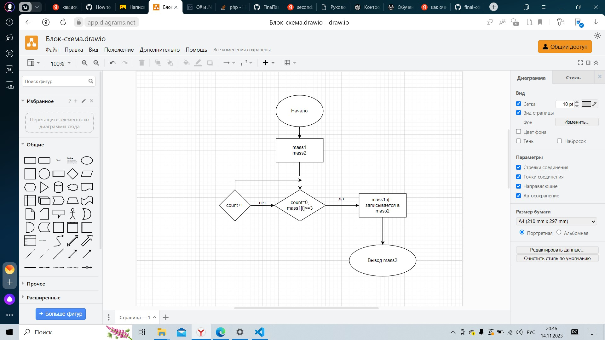

# Написать программу, которая из имеющегося массива строк формирует новый массив из строк, длина которых меньше, либо равна 3 символам. Первоначальный массив можно ввести с клавиатуры, либо задать на старте выполнения алгоритма. При решении не рекомендуется пользоваться коллекциями, лучше обойтись исключительно массивами
Текстовое описание решения:
Изначально объявляется два массива, при этом длина данных массиво равна. Далее создается метод, который проходит по элементам первого массива и проверяет условие что длина каждого элемента массива меньше или равна 3. Если данное условие выполняется элемент записывается во второй массив, иначе нет.

